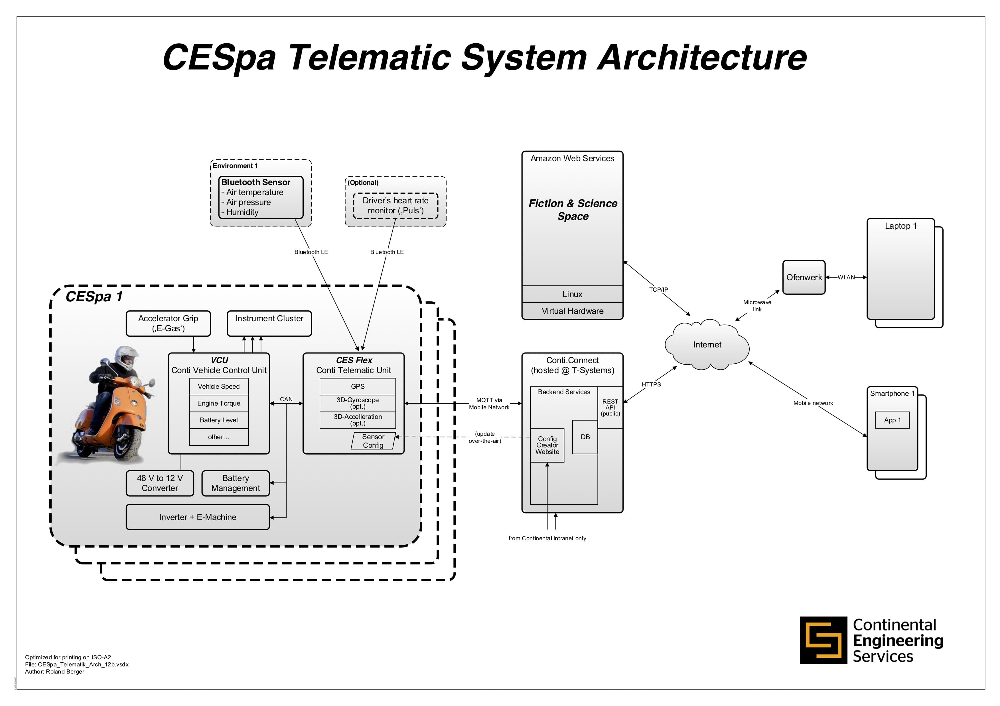

# node-red-CESpa

This project was accomplished during the #fiction2science Smart Mobility Hackathon organised and hosted by Continental in Nürnberg (23.05-25.05.2019).
We came up with the idea about implementing some nodes for the given CESpa scooter to integrate with nodeRED.  

Also we implemented some demo flows in NodeRED that display the potential use of the nodes. (see )

## Implemented nodes
All nodes have the ability to define a threshold of how long into the past the request should pull the information from the api.

### acceleration
- Devide ID (did)
- ACC_X (x)
- ACC_Y (y)
- ACC_Z (z)

### charge
- Devide ID (did)
- Charge State (chargeState)

### getoperationgmode
- Devide ID (did)
- Operating Mode (em_opm)

### gpsspeed
- Devide ID (did)
- Device Speed (spd)

### lon-lat
- Devide ID (did)
- Longitude (lon)
- Latitude (lat)
- Altitude (altitude)

### temp-humidity
- Devide ID (did)
- Temperature (temp)
- Humidity (hum)

### torque
- Devide ID (did)
- Actual estimated torque (torque)

### vehiclespeed
- Devide ID (did)
- Actual speed (act_spd)


## Overall system architecture


## Implemented NodeRED flows

### intelliCharge
Displays the idea of a smart charging system to save costs and relieve the power grid.

### theftProtection
This is a protection mechanisim which the user can activate with setting a timezone where the CESpa should be protected.

### userProfiling
A kind of gamified flow which calculates points based on the drivers behaviour.

### worldmap
The current position of the CESpa gets tracked as a route on a map.


## Try out our nodes
First pull this repo to a desired place on your machine. Then you need to tell npm that it should install all dependencies. Afterwards you need to create a link of this package.
```shell
$ git pull https://github.com/fklement/node-red-cespa
$ cd node-red-cespa
$ npm install
$ npm link
```
After you successfully installed/linked the package you can now switch to your local NodeRED folder `.node-red` which is located in your home directory. (For windows users this folder is most likely located in `%AppData%`). 

```shell
$ npm link node-red-cespa
```

Now you are ready to go to import the overAllFlow.json in your NodeRED installation.

## Known issues
- To much responses per sekond (~ 40-60, should only be 4)
  
If you find a issue, feel free to resolve the problem and open a pull request.